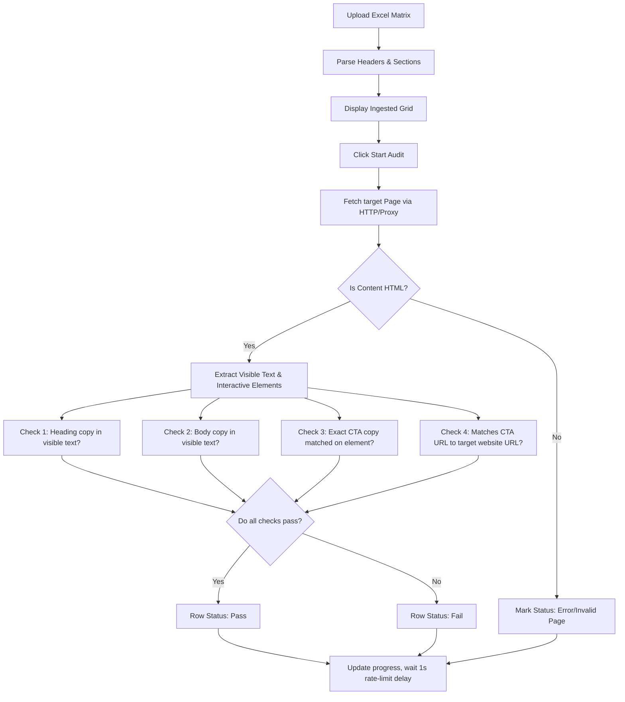

# AuditFlow System 🔍📊

AuditFlow is a professional **Compliance Content Ingestion & Auditing Module** built with React, Vite, TypeScript, and Tailwind CSS. It is designed to ingest localization copy matrices (often formatted as complex, multi-section Excel sheets with mixed structures and comments) and run automated compliance audits on the copy (Heading, Body, Call to Action, and Destination URLs) of localized web landing pages.

The system uses an asynchronous audit pipeline with rate-limiting mitigation, request timeouts, and single-row manual retries, outputting granular pass/fail reports and summary dashboards into a downloadable dual-sheet Excel file.

---

## 🚀 Key Features

- **Robust Ingestion of Irregular Excel Layouts**: Scans complex sheets top-to-bottom, isolating multiple tabular data blocks separated by blank lines and comments, auto-mapping columns case-insensitively.
- **Copy Compliance Audit Engine**: Validates whether the layout and copy on live pages match the spreadsheet requirements:
  - **Heading copy** check (visible on-page presence).
  - **Body copy** check (visible on-page presence).
  - **CTA copy** check (exact text match on interactive elements like links, buttons, and `[role="button"]`).
  - **CTA Destination URL** check (resolves relative URLs against the target page, normalizes protocols/trailing slashes, and compares to the expected link).
- **Execution Controller**: Real-time progress updates with estimated time remaining (based on actual processing speed), pause/resume capabilities, and single-row retry capabilities.
- **CORS Handling & Localhost Support**: Employs an online proxy (`allorigins.win`) for live public sites, while seamlessly switching to direct fetch for localhost environments during development.
- **Dual-Sheet Export**: Generates a polished Excel workbook (`auditflow_results.xlsx`) containing:
  - **Compliance Report**: The original matrix columns appended with individual verification checks.
  - **Summary**: Aggregated pass/fail/error/skip metrics per check category.

---

## 🛠️ Technology Stack

- **Core**: React 19, TypeScript, Vite, Tailwind CSS (v3)
- **Icons**: Lucide React
- **Excel Parsing/Generation**: SheetJS (`xlsx`)
- **Parsing/Scraping**: DOMParser for HTML analysis

---

## 📂 Project Structure

```
AuditFlow/
├── public/                     # Static assets and generated mock web pages
│   └── vishnuvogue/            # Localized mockup HTML files for testing
├── src/
│   ├── components/
│   │   ├── Header.tsx          # Brand header component
│   │   ├── UploadZone.tsx      # Ingestion drag-and-drop panel
│   │   ├── PreviewTable.tsx    # Live grid display with column freezing & retries
│   │   └── Stats.tsx           # Status panel, audit controls & statistics
│   ├── utils/
│   │   ├── auditEngine.ts      # Main copy extraction and DOM comparison rules
│   │   ├── excelParser.ts      # Multi-section irregular spreadsheet parser
│   │   └── excelExporter.ts    # Dual-sheet Excel report builder
│   ├── App.tsx                 # Core application controller and audit loop
│   ├── index.css               # Tailored styles and custom glassmorphism components
│   └── main.tsx                # App entrypoint
├── create-test-excel.cjs       # Node script: Generates irregular layout spreadsheet
├── generate-html-pages.cjs     # Node script: Compiles localized mock test HTML files
├── generate-audit-excel.cjs    # Node script: Compiles Vishnuvogue copy-matrix excel
└── package.json                # Project configuration & npm scripts
```

---

## 💻 Developer Scripts & Setup

### 1. Ingestion Excel Generation (`create-test-excel.cjs`)
Generates `test-irregular.xlsx` in the root folder, simulating standard spreadsheet noise: metadata header rows, blank separation rows, notes, and dual tables with mismatched column headers casing.
```bash
node create-test-excel.cjs
```

### 2. Mock Localization Generation (`generate-html-pages.cjs`)
Generates 10 localized mock HTML pages for the "Vishnuvogue" fashion brand (located in Dharavi, Mumbai) inside `public/vishnuvogue/` (covering `us-en.html`, `in-hi.html`, `fr-fr.html`, etc.) for local auditing.
```bash
node generate-html-pages.cjs
```

### 3. Localization Matrix Excel (`generate-audit-excel.cjs`)
Generates `vishnuvogue_audit.xlsx` in the root folder. This pre-populates the 10 correct localized headings, bodies, CTAs, and their local URLs to audit against the generated Vishnuvogue mockup pages.
```bash
node generate-audit-excel.cjs
```

---

## ⚡ Quick Start

Follow these steps to run AuditFlow and perform a test audit locally:

### 1. Install dependencies
```bash
npm install
```

### 2. Generate the mock HTML files & test Excel matrix
```bash
# Compile mock pages into public directory
node generate-html-pages.cjs

# Create the Vishnuvogue audit sheet
node generate-audit-excel.cjs
```

### 3. Run the development server
```bash
npm run dev
```
By default, the application runs on `http://localhost:5173`.

### 4. Perform the audit
1. Open the app in your browser (`http://localhost:5173`).
2. Upload the generated `vishnuvogue_audit.xlsx` file.
3. Review the ingested spreadsheet rows in the Preview table.
4. Click **Start Audit** in the controls panel.
5. The engine will sequentially fetch and inspect the mock local pages.
6. When complete, click **Export Results** to download your dual-sheet Excel report.

---

## ⚙️ How the Audit Works



### Audit Parameters Table

| Check Type | Target Selector | Matching Rule | Behavior on Empty Sheet Cell |
| :--- | :--- | :--- | :--- |
| **Heading Check** | Full text content of the page | Case-insensitive substring match | Auto-passes (`true`) |
| **Body Check** | Full text content of the page | Case-insensitive substring match | Auto-passes (`true`) |
| **CTA Text Check** | `a, button, [role="button"], input[type="button"], input[type="submit"]` | Case-insensitive exact text match | Auto-passes (`true`) |
| **CTA URL Check** | Matching CTA element href / formaction / data-href | URL comparison (compares protocol-less, trailing-slash-less, and relative-resolved URLs) | Auto-passes (`true`) |

---

## 🛡️ License

Private internal tool for layout compliance. Built for automated digital copy verification.
